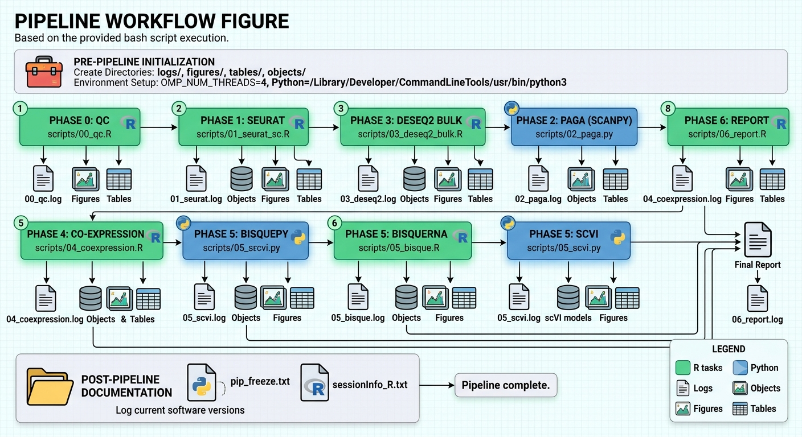

# Joint Bulk + Single-Cell RNA-seq Analysis — *Arabidopsis* Root (GSE123818)

**Reference:** Denyer et al. (2019) *Developmental Cell* | GEO **GSE123818**

## Reproducibility
- Random seed: **42** (R and Python)
- Single-cell input: `GSE123818_Root_single_cell_wt_datamatrix.csv.gz` (wild-type protoplast scRNA-seq)
- Bulk input: `GSE123818_Root_bulk_tissue_datamatrix.txt.gz`
- Package versions: see `logs/sessionInfo_R.txt` and `logs/pip_freeze.txt`

## Phase 0 — Input QC
- Single-cell: 27629 genes × 4727 cells; 82.2% zeros
- Bulk: 27628 genes × 4 samples; 20.6% zeros
- Shared AGI genes for joint analysis: **27628**

## Scientific Question 1 — Which root cell types contribute to the bulk signal?

We applied **BisqueRNA** reference-based deconvolution using the annotated wild-type single-cell
reference (2 biological replicates: rep1/rep2 from 10x barcode suffixes) and bulk VST expression.

**Caveat:** Only **2 subjects/replicates** are available in the sc reference — BisqueRNA reliability
is limited; interpret proportions as approximate.

Mean estimated cell-type proportions across bulk samples (RP1/2 protoplasted, RU1/2 unprotoplasted):
- **Atrichoblast**: 18.2%
- **Columella_LRC**: 22.9%
- **Cortex**: 14.3%
- **Endodermis**: 15.2%
- **Phloem**: 1.5%
- **Procambium**: 5.0%
- **QC**: 12.2%
- **Trichoblast**: 10.7%

**Figure:** `figures/deconvolution_stacked_bar.png`

## Scientific Question 2 — Which genes behave similarly across bulk and single-cell?

- Overall pseudobulk vs bulk mean: Pearson r = **0.865**, Spearman rho = **0.863**
- Per-cell-type pseudobulk correlations in `tables/pseudobulk_bulk_correlations.csv`
- Simplified co-expression module comparison (500 top variable genes, k=6):
  `tables/coexpression_modules.csv` and concordant genes in `tables/cross_modality_concordant_genes.csv`

**Figures:** `figures/pseudobulk_bulk_scatter_overall.png` and per-cell-type scatters

**Note:** Bulk and sc differ in capture (protoplast vs tissue); rank-based correlation on
normalized/VST data reduces platform bias.

## Scientific Question 3 — How do sc developmental trajectories relate to bulk expression?

PAGA on annotated cell types reveals connectivity between root lineages (QC → stem/procambium →
tissue layers). DPT pseudotime rooted at **QC/meristem** orders cells along developmental axes.

# Trajectory summary (PAGA + DPT)

- **Atrichoblast**: median pseudotime = 0.176 (n=768)
- **Columella_LRC**: median pseudotime = 0.217 (n=968)
- **Cortex**: median pseudotime = 0.158 (n=600)
- **Endodermis**: median pseudotime = 0.402 (n=642)
- **Phloem**: median pseudotime = 0.221 (n=65)
- **Procambium**: median pseudotime = 0.532 (n=210)
- **QC**: median pseudotime = 0.065 (n=515)
- **Trichoblast**: median pseudotime = 0.460 (n=449)

Bulk samples include **protoplasted (RP)** vs **unprotoplasted (RU)** replicates; DESeq2 identified
**6701 DEGs** (padj<0.05, |log2FC|>1) induced by protoplasting — these were excluded from
single-cell interpretation per Denyer et al. Trajectories in sc data mirror bulk sensitivity to
protoplasting stress in the contrast `protoplasted vs unprotoplasted`.

**Figures:** `figures/paga_graph.png`, `figures/paga_dpt_pseudotime.png`, `figures/bulk_pca.png`

## Single-cell processing summary
- Data modality: **single-cell (protoplast)** — not single-nuclei
- QC filters: nFeature 500–8000, nCount ≥500, organellar (ATMG/ATCG) ≤5%; organellar genes excluded from HVGs
- Clustering: Seurat PCA + Leiden (resolution 0.6); cell types assigned by canonical root marker module scores

## Bulk processing summary
- DESeq2 on count matrix (no alignment needed); contrast: protoplasted vs unprotoplasted
- Outputs: VST matrix, PCA, sample-distance heatmap, volcano, DEG heatmap

## Deliverables
| Path | Description |
|------|-------------|
| `objects/sc_wt_annotated.h5ad` | Annotated sc AnnData |
| `objects/scvi_model/` | scVI trained model |
| `objects/bulk_deseq.rds` | DESeq2 objects |
| `objects/seurat_wt_annotated.rds` | Seurat object |
| `tables/` | Markers, DE, correlations, deconvolution |
| `figures/` | All plots (PNG + PDF) |
